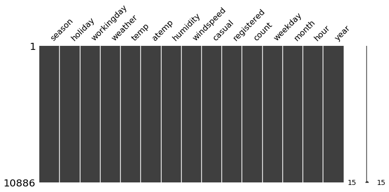
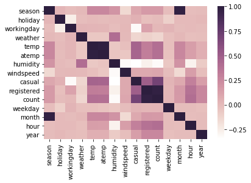
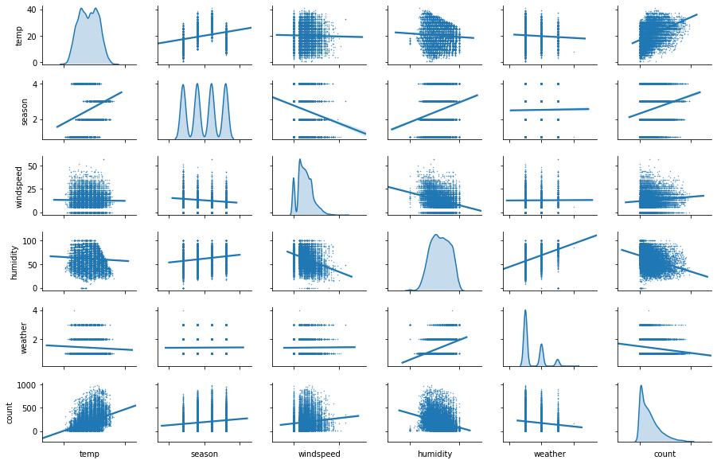
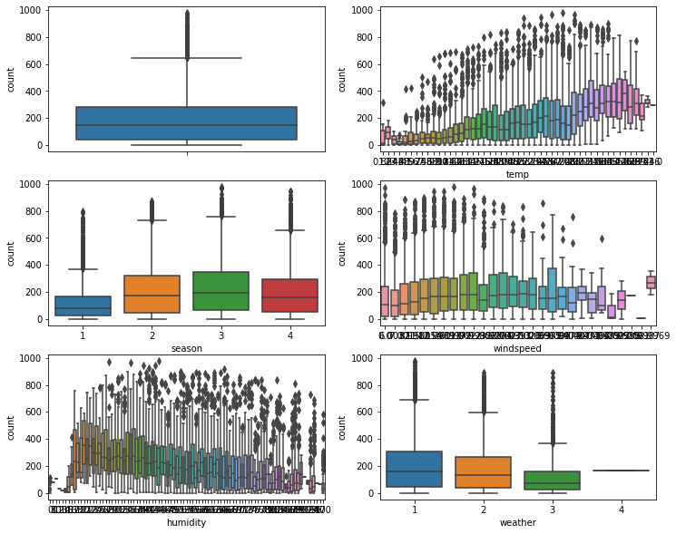
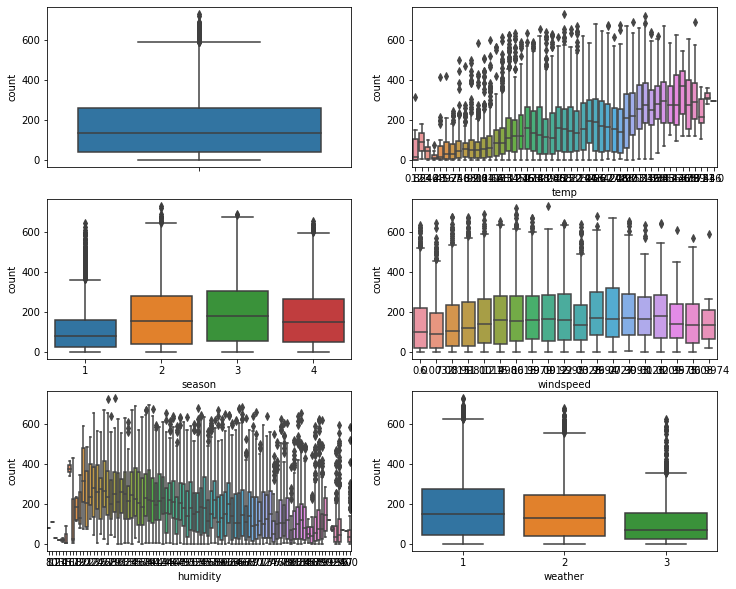
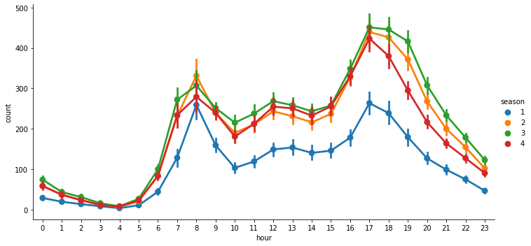
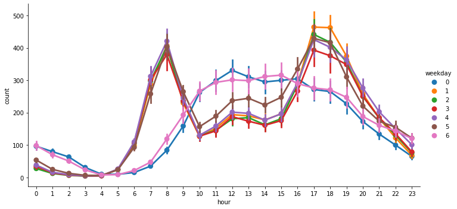
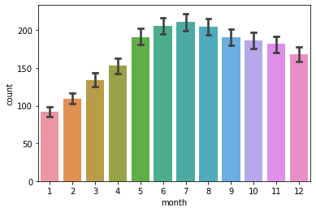

```python
import warnings
warnings.simplefilter("ignore")
```


```python
import os
import pandas as pa
from datetime import datetime as dt
import numpy as np
%matplotlib inline
import matplotlib.pyplot as plt
import seaborn as sns
```

# Setup


```python
PLOTS_PATH = "plots/"
def save_fig(fig_id, tight_layout=True, fig_extension="png", resolution=300):
    path = os.path.join(PLOTS_PATH, fig_id + "." + fig_extension)
    print("Saving plot", fig_id)
    if tight_layout:
        plt.tight_layout()
    plt.savefig(path, format=fig_extension, dpi=resolution)
    print("plot saved", fig_id)
```

# Get the data


```python
DATA_DIR_PATH = "data/"
TRAIN_FILE = "train.csv"
TEST_FILE = "test.csv"

def load_csv_data(file_path, file_name):
    return pa.read_csv(os.path.join( file_path, file_name) )

train_data = load_csv_data(DATA_DIR_PATH,TRAIN_FILE)
```

# Data Analysis
lets have a look at the data and figure out what can we infer from it.


```python
# Copy dataset for analysis and manupulations.
analysis_data_set = train_data.copy()
```


```python
# get the metadata of the data.
analysis_data_set.info()
```

    <class 'pandas.core.frame.DataFrame'>
    RangeIndex: 10886 entries, 0 to 10885
    Data columns (total 12 columns):
    datetime      10886 non-null object
    season        10886 non-null int64
    holiday       10886 non-null int64
    workingday    10886 non-null int64
    weather       10886 non-null int64
    temp          10886 non-null float64
    atemp         10886 non-null float64
    humidity      10886 non-null int64
    windspeed     10886 non-null float64
    casual        10886 non-null int64
    registered    10886 non-null int64
    count         10886 non-null int64
    dtypes: float64(3), int64(8), object(1)
    memory usage: 1020.6+ KB


### Observation:

* We have 12 columns. 11 Features and 1 Target. 
* Data types : 3 Float, 8 int and 1 Object.

We need take care of Object datatype. i.e., _datetime_ feature. Because most of the model training algorithims accept features as numeric datatypes. 

To get a better understanding of the data. Lets print the first 5 rows of the data table. 


```python
analysis_data_set.head()
```


<div>
<style scoped>
    .dataframe tbody tr th:only-of-type {
        vertical-align: middle;
    }

    .dataframe tbody tr th {
        vertical-align: top;
    }

    .dataframe thead th {
        text-align: right;
    }
</style>
<table border="1" class="dataframe">
  <thead>
    <tr style="text-align: right;">
      <th></th>
      <th>datetime</th>
      <th>season</th>
      <th>holiday</th>
      <th>workingday</th>
      <th>weather</th>
      <th>temp</th>
      <th>atemp</th>
      <th>humidity</th>
      <th>windspeed</th>
      <th>casual</th>
      <th>registered</th>
      <th>count</th>
    </tr>
  </thead>
  <tbody>
    <tr>
      <th>0</th>
      <td>2011-01-01 00:00:00</td>
      <td>1</td>
      <td>0</td>
      <td>0</td>
      <td>1</td>
      <td>9.84</td>
      <td>14.395</td>
      <td>81</td>
      <td>0.0</td>
      <td>3</td>
      <td>13</td>
      <td>16</td>
    </tr>
    <tr>
      <th>1</th>
      <td>2011-01-01 01:00:00</td>
      <td>1</td>
      <td>0</td>
      <td>0</td>
      <td>1</td>
      <td>9.02</td>
      <td>13.635</td>
      <td>80</td>
      <td>0.0</td>
      <td>8</td>
      <td>32</td>
      <td>40</td>
    </tr>
    <tr>
      <th>2</th>
      <td>2011-01-01 02:00:00</td>
      <td>1</td>
      <td>0</td>
      <td>0</td>
      <td>1</td>
      <td>9.02</td>
      <td>13.635</td>
      <td>80</td>
      <td>0.0</td>
      <td>5</td>
      <td>27</td>
      <td>32</td>
    </tr>
    <tr>
      <th>3</th>
      <td>2011-01-01 03:00:00</td>
      <td>1</td>
      <td>0</td>
      <td>0</td>
      <td>1</td>
      <td>9.84</td>
      <td>14.395</td>
      <td>75</td>
      <td>0.0</td>
      <td>3</td>
      <td>10</td>
      <td>13</td>
    </tr>
    <tr>
      <th>4</th>
      <td>2011-01-01 04:00:00</td>
      <td>1</td>
      <td>0</td>
      <td>0</td>
      <td>1</td>
      <td>9.84</td>
      <td>14.395</td>
      <td>75</td>
      <td>0.0</td>
      <td>0</td>
      <td>1</td>
      <td>1</td>
    </tr>
  </tbody>
</table>
</div>


_datetime_ feature is datetime formatted. Parse the required information for our model and drop the feature.

Extract _"weekday","month","hour","year"_ from _datetime_ object and add them as seperate features in our dataset. Then drop the _datatime_ feature. We must do the same process for validation and test instances.


```python
# "weekday","month","hour","year" extraction
def transform(X):
    c_datetime = X["datetime"].unique()
    formatted_dt = [dt.strptime(x, "%Y-%m-%d %H:%M:%S") for x in c_datetime]
    X["weekday"] = extract_part_from_date(formatted_dt,"%w")
    X["month"] = extract_part_from_date(formatted_dt,"%m")
    X["hour"] = extract_part_from_date(formatted_dt,"%H")
    X["year"] = extract_part_from_date(formatted_dt,"%Y")

    int_features = ["weekday","month","hour","year"]
    for feature in int_features:
        X[feature] = X[feature].astype(np.int64)

    return X

def extract_part_from_date(dates, code_str):
    return [date.strftime(code_str) for date in dates]

analysis_data_set = transform(analysis_data_set)    
analysis_data_set = analysis_data_set.drop(["datetime"], axis=1)

# print first 6 instances of the dataset
analysis_data_set.head(6)
```


<div>
<style scoped>
    .dataframe tbody tr th:only-of-type {
        vertical-align: middle;
    }

    .dataframe tbody tr th {
        vertical-align: top;
    }

    .dataframe thead th {
        text-align: right;
    }
</style>
<table border="1" class="dataframe">
  <thead>
    <tr style="text-align: right;">
      <th></th>
      <th>season</th>
      <th>holiday</th>
      <th>workingday</th>
      <th>weather</th>
      <th>temp</th>
      <th>atemp</th>
      <th>humidity</th>
      <th>windspeed</th>
      <th>casual</th>
      <th>registered</th>
      <th>count</th>
      <th>weekday</th>
      <th>month</th>
      <th>hour</th>
      <th>year</th>
    </tr>
  </thead>
  <tbody>
    <tr>
      <th>0</th>
      <td>1</td>
      <td>0</td>
      <td>0</td>
      <td>1</td>
      <td>9.84</td>
      <td>14.395</td>
      <td>81</td>
      <td>0.0000</td>
      <td>3</td>
      <td>13</td>
      <td>16</td>
      <td>6</td>
      <td>1</td>
      <td>0</td>
      <td>2011</td>
    </tr>
    <tr>
      <th>1</th>
      <td>1</td>
      <td>0</td>
      <td>0</td>
      <td>1</td>
      <td>9.02</td>
      <td>13.635</td>
      <td>80</td>
      <td>0.0000</td>
      <td>8</td>
      <td>32</td>
      <td>40</td>
      <td>6</td>
      <td>1</td>
      <td>1</td>
      <td>2011</td>
    </tr>
    <tr>
      <th>2</th>
      <td>1</td>
      <td>0</td>
      <td>0</td>
      <td>1</td>
      <td>9.02</td>
      <td>13.635</td>
      <td>80</td>
      <td>0.0000</td>
      <td>5</td>
      <td>27</td>
      <td>32</td>
      <td>6</td>
      <td>1</td>
      <td>2</td>
      <td>2011</td>
    </tr>
    <tr>
      <th>3</th>
      <td>1</td>
      <td>0</td>
      <td>0</td>
      <td>1</td>
      <td>9.84</td>
      <td>14.395</td>
      <td>75</td>
      <td>0.0000</td>
      <td>3</td>
      <td>10</td>
      <td>13</td>
      <td>6</td>
      <td>1</td>
      <td>3</td>
      <td>2011</td>
    </tr>
    <tr>
      <th>4</th>
      <td>1</td>
      <td>0</td>
      <td>0</td>
      <td>1</td>
      <td>9.84</td>
      <td>14.395</td>
      <td>75</td>
      <td>0.0000</td>
      <td>0</td>
      <td>1</td>
      <td>1</td>
      <td>6</td>
      <td>1</td>
      <td>4</td>
      <td>2011</td>
    </tr>
    <tr>
      <th>5</th>
      <td>1</td>
      <td>0</td>
      <td>0</td>
      <td>2</td>
      <td>9.84</td>
      <td>12.880</td>
      <td>75</td>
      <td>6.0032</td>
      <td>0</td>
      <td>1</td>
      <td>1</td>
      <td>6</td>
      <td>1</td>
      <td>5</td>
      <td>2011</td>
    </tr>
  </tbody>
</table>
</div>


### Discover and visualize the data to gain insights

### Finding missing values


```python
import missingno as msno
msno.matrix(analysis_data_set,figsize=(12,5))
```


    <matplotlib.axes._subplots.AxesSubplot at 0x7fead3aa8d68>





### Correlation

lets find the pairwise correlation of all features in the our dataset. Non-numeric features are ignored automatically by the `.corr()` function in pandas.


```python
corr_matrix=analysis_data_set.corr()
corr_matrix["count"].sort_values(ascending=False)
```


    count         1.000000
    registered    0.970948
    casual        0.690414
    hour          0.400601
    temp          0.394454
    atemp         0.389784
    year          0.260403
    month         0.166862
    season        0.163439
    windspeed     0.101369
    weekday       0.027690
    workingday    0.011594
    holiday      -0.005393
    weather      -0.128655
    humidity     -0.317371
    Name: count, dtype: float64


```python
cmap = sns.cubehelix_palette(light=1, as_cmap=True)
sns.heatmap(corr_matrix, cmap=cmap)
```


    <matplotlib.axes._subplots.AxesSubplot at 0x7fead3a376d8>





```python
features = ["temp","season","windspeed","humidity","weather","count"]
g = sns.pairplot(analysis_data_set,
                 vars= features,
                 palette = 'husl',
                 height=1.4,
                 aspect = 1.5,
                 kind='reg',
                 diag_kind = 'kde',
                 diag_kws=dict(shade=True),
                 plot_kws=dict(scatter_kws={'s':.2}),
                 
            )
g.set(xticklabels=[])
```


    <seaborn.axisgrid.PairGrid at 0x7fead3802ef0>





### Inference:
* _humidity, weather_ have strong negative relation 
* and _temp, season, windspeed_ have strong positive relation the target (_count_). 
* Other features such as  _weekday, workingday, year, month_ have considered corelation value.   
* _atemp_ is highly correlated with _temp_, as how _registered, casual_ are correlated, so we can ignore _atemp, registered, casual_ features for our model.  

### Outliers

Identify outliers in target and in the features that have strong corelation with the target.


```python
# "temp","season","windspeed","humidity","weather","count"
def bxplot(data):
    fig, axes =  plt.subplots(nrows=3,ncols=2)
    fig.set_size_inches(12,10)
    sns.boxplot(y=data['count'],ax=axes[0][0])
    sns.boxplot(x=data['temp'],y=data['count'],ax=axes[0][1])
    sns.boxplot(x=data['season'],y=data['count'],ax=axes[1][0])
    sns.boxplot(x=data['windspeed'],y=data['count'],ax=axes[1][1])
    sns.boxplot(x=data['humidity'],y=data['count'],ax=axes[2][0])
    sns.boxplot(x=data['weather'],y=data['count'],ax=axes[2][1])
    
```


```python
bxplot(analysis_data_set)
```





Remove values on all features which are above 3 Standard deviations


```python
from scipy.stats import zscore
analysis_data_set = analysis_data_set[(np.abs(zscore(analysis_data_set)) < 3).all(axis=1)]
```


```python
bxplot(analysis_data_set)
```





Addtional informations on the data.


```python
# hour 
sns.catplot(x='hour',y='count', hue="season", data=analysis_data_set, kind="point", aspect=2)
```


    <seaborn.axisgrid.FacetGrid at 0x7feab22970b8>





### Inference :

* Across all the season the rental timing seems to be similar, yet the number of rentals varies by season. 
* The green season has almost double the count of blue during evening ( 17:00 - 19:00 )
* During morning hours ( 7:00 - 9:00 ) the count variance small comparied to evening 


```python
# day
sns.catplot(x='hour',y='count',hue="weekday",data=analysis_data_set, kind="point", aspect=2)
```


    <seaborn.axisgrid.FacetGrid at 0x7feab27255f8>





### Inference :

* The count is high during weekdays and low during weekends
* On weekdays, morning and evening the count is at the peak. We may assume that is due to office goers.
* Whereas on the weekends the count is flat and spread across the midday. Could be leisure rental.


```python
# month wise rent
sns.barplot(x="month", y="count", data=analysis_data_set, capsize=0.2)
```


    <matplotlib.axes._subplots.AxesSubplot at 0x7feab8d68ef0>





#### Inference :
* Count is lower on the year start and gradually increases during the mid year.
* Then the Count starts decreasing smoothly and reaches little more than the average count during month end.  

With all the analysis, observations and inference we have a better idea on the features and the manupulations to be carried out on the data before we feed it into out machine learning algorithms for training and predictions. 

# Prepare the Data for Machine Learning Algorithms

### Train and Test split 

Stratified sampling. Spliting data for test and train set by stratifying based on season i.e., equal number of intances are fetched from each seasons.


```python
# train and test split 
from sklearn.model_selection import StratifiedShuffleSplit

stratified = StratifiedShuffleSplit(n_splits=1,test_size=0.2,random_state=42)
for train_i, validation_i in stratified.split(train_data, train_data['season']):
    strat_train_set = train_data.loc[train_i]
    strat_validation_set = train_data.loc[validation_i]
```


```python
from sklearn.model_selection import train_test_split
train, validation = train_test_split(train_data, test_size=0.2, random_state=42)
```


```python
train_X = strat_train_set.drop(["count"],axis=1).copy()
train_Y = strat_train_set["count"].copy()
```


```python
train_X.info()
```

    <class 'pandas.core.frame.DataFrame'>
    Int64Index: 8708 entries, 10880 to 1260
    Data columns (total 11 columns):
    datetime      8708 non-null object
    season        8708 non-null int64
    holiday       8708 non-null int64
    workingday    8708 non-null int64
    weather       8708 non-null int64
    temp          8708 non-null float64
    atemp         8708 non-null float64
    humidity      8708 non-null int64
    windspeed     8708 non-null float64
    casual        8708 non-null int64
    registered    8708 non-null int64
    dtypes: float64(3), int64(7), object(1)
    memory usage: 816.4+ KB


## Transformation Pipelines

Lets create custome transformation classes for 
* Date extraction
* Columns drop
* Outliers removals

### Date extraction transformer


```python
from sklearn.base import BaseEstimator, TransformerMixin

class DatePreprocessor(BaseEstimator, TransformerMixin):
    def __init__(self):
        return None
    
    def fit(self,X,y=None):
        return self
    
    def transform(self, X, y=None):
        c_datetime = X["datetime"].unique()
        formatted_dt = [dt.strptime(x, "%Y-%m-%d %H:%M:%S") for x in c_datetime]
        X["weekday"] = self.extract_part_from_date(formatted_dt,"%w")
        X["month"] = self.extract_part_from_date(formatted_dt,"%m")
        X["hour"] = self.extract_part_from_date(formatted_dt,"%H")
        X["year"] = self.extract_part_from_date(formatted_dt,"%Y")
        
        int_features = ["weekday","month","hour","year"]
        for feature in int_features:
            X[feature] = X[feature].astype(np.int64)
        return X
    
    def extract_part_from_date(self, dates, code_str):
        return [date.strftime(code_str) for date in dates]
```

### Transformer to drop columns


```python
class DropColumns(BaseEstimator, TransformerMixin):
    
    def __init__(self, columns):
        self.columns = columns
    
    def fit(self,X):
        return self
    
    def transform(self, X):
        X = X.drop(self.columns, axis=1)
        return X 
```

### Pipeline class to help with sequences of transformations

Place our custome transformation classes in the pipeline 


```python
from sklearn.pipeline import Pipeline
from sklearn.preprocessing import StandardScaler
drop_cols = ['datetime','registered','casual','atemp']
num_pipline = Pipeline([
        ("date_processor", DatePreprocessor()),
        ("drop_cols", DropColumns(columns = drop_cols) )
])
```


```python
from sklearn.compose import ColumnTransformer
from sklearn.preprocessing import OneHotEncoder
num_attribs = list(train_X)

cat_attribs = ["season","weather"]

cat_pipeline = ColumnTransformer([
    ("num_pipline", num_pipline, num_attribs), # Handling Text and Categorical Attributes
    ("cat_pipline", OneHotEncoder(sparse=False, categories='auto'), cat_attribs) 
])

train_prepared = cat_pipeline.fit_transform(train_X)
```

### Remove outliers


```python
# train_prepared = train_prepared[(np.abs(zscore(train_prepared)) < 3).all(axis=1)]
```

# Select and Train a model


```python
from sklearn.ensemble import RandomForestRegressor
rfr = RandomForestRegressor()
rfr.fit(train_prepared,train_Y)
```


    RandomForestRegressor(bootstrap=True, criterion='mse', max_depth=None,
                          max_features='auto', max_leaf_nodes=None,
                          min_impurity_decrease=0.0, min_impurity_split=None,
                          min_samples_leaf=1, min_samples_split=2,
                          min_weight_fraction_leaf=0.0, n_estimators=10,
                          n_jobs=None, oob_score=False, random_state=None,
                          verbose=0, warm_start=False)


```python
validation_x = validation.drop(['count'],axis=1)
validation_y = validation['count'].copy()

num_attribs = list(validation_x)
cat_attribs = ["season","weather"]
drop_cols = ['datetime','registered','casual','atemp','holiday']
validation_x_prepared = cat_pipeline.transform(validation_x)
rfr_prediction = rfr.predict(validation_x_prepared)
```

##  RMSE


```python
rfr_prediction[:2], validation_y[:2]
```


    (array([142.3,   5.7]), 3133    127
     5786     13
     Name: count, dtype: int64)


```python
from sklearn.metrics import mean_squared_error

mse = mean_squared_error(validation_y,rfr_prediction)
lin_rmse = np.sqrt(mse)
lin_rmse
```


    24.302286928294603


## Better Evaluation Using Cross-Validation


```python
from sklearn.model_selection import cross_val_score
scores = cross_val_score(rfr, validation_x_prepared, validation_y, cv=10, scoring="neg_mean_squared_error")
rmse_scores = np.sqrt(-scores)
```


```python
scores
```


    array([-3352.73142202, -4898.57990826, -3509.71454128, -3507.10073394,
           -5680.54009174, -3047.6583945 , -3744.5553211 , -4245.91665138,
           -4077.73147465, -2510.01009217])


```python
scores.mean()
```


    -3857.453863104046


```python
scores.std()
```


    871.1800384629835


Previously we used RandomForestRegressor, now lets try various other algorithms and find out which model performs better on our data. Then we pick that model and do some fine tuning.  


```python
from sklearn.ensemble import RandomForestRegressor,BaggingRegressor,GradientBoostingRegressor,AdaBoostRegressor
from sklearn.svm import SVR
from sklearn.neighbors import KNeighborsRegressor

models=[RandomForestRegressor(),AdaBoostRegressor(),BaggingRegressor(),SVR(),KNeighborsRegressor()]
model_names=['RandomForestRegressor','AdaBoostRegressor','BaggingRegressor','SVR','KNeighborsRegressor']
```


```python
validation_x = strat_validation_set.drop(['count'],axis=1)
validation_y = strat_validation_set['count'].copy()
num_attribs = list(validation_x)
cat_attribs = ['season','weather']
drop_cols = ['datetime','registered','casual','atemp','holiday']

rmses=[]
stds = []
d={}
trained_models = []
for model in models:
    model.fit(train_prepared,train_Y)
    trained_models.append(model)
    validation_x_prepared = cat_pipeline.transform(validation_x)
    prediction = model.predict(validation_x_prepared)
    # validation
    scores = cross_val_score(model, validation_x_prepared, validation_y, cv=10, scoring="neg_mean_squared_error")
    rmse_scores = np.sqrt(-scores)
    rmses.append(rmse_scores.mean())
    stds.append(rmse_scores.std())
    
d = {"Models": model_names, "mean rsme score": rmses, "Standard deviation": stds}
df = pa.DataFrame(d)
df
```


<div>
<style scoped>
    .dataframe tbody tr th:only-of-type {
        vertical-align: middle;
    }

    .dataframe tbody tr th {
        vertical-align: top;
    }

    .dataframe thead th {
        text-align: right;
    }
</style>
<table border="1" class="dataframe">
  <thead>
    <tr style="text-align: right;">
      <th></th>
      <th>Models</th>
      <th>mean rsme score</th>
      <th>Standard deviation</th>
    </tr>
  </thead>
  <tbody>
    <tr>
      <th>0</th>
      <td>RandomForestRegressor</td>
      <td>58.189837</td>
      <td>4.715307</td>
    </tr>
    <tr>
      <th>1</th>
      <td>AdaBoostRegressor</td>
      <td>108.530686</td>
      <td>4.647236</td>
    </tr>
    <tr>
      <th>2</th>
      <td>BaggingRegressor</td>
      <td>57.287295</td>
      <td>5.345641</td>
    </tr>
    <tr>
      <th>3</th>
      <td>SVR</td>
      <td>185.485112</td>
      <td>18.690438</td>
    </tr>
    <tr>
      <th>4</th>
      <td>KNeighborsRegressor</td>
      <td>132.828887</td>
      <td>9.755867</td>
    </tr>
  </tbody>
</table>
</div>


We can pick a model which has lower mean rsme score and it good to consider the standard deviation as well.


```python
df.loc[df['mean rsme score'].idxmin()]
```


    Models                BaggingRegressor
    mean rsme score                57.2873
    Standard deviation             5.34564
    Name: 2, dtype: object


RandomForestRegressor has performed better on our data than the other algorithms. So lets proceed with RandomForestRegressor with little fine tuning. 


```python
model = trained_models[0]
model
```


    RandomForestRegressor(bootstrap=True, criterion='mse', max_depth=None,
                          max_features='auto', max_leaf_nodes=None,
                          min_impurity_decrease=0.0, min_impurity_split=None,
                          min_samples_leaf=1, min_samples_split=2,
                          min_weight_fraction_leaf=0.0, n_estimators=10,
                          n_jobs=None, oob_score=False, random_state=None,
                          verbose=0, warm_start=False)


### Random Forest Regressor performs better
Lets Fine-Tune this Model. We could find best parameters for our models using GridSearchCV or RandomizedSearchCV. Lets try both.

#### Find specified parameter values for our model using GridSearchCV


```python
from sklearn.model_selection import GridSearchCV

param_grid = [
    {'n_estimators': [3,10,20,30]}
]

rfr = RandomForestRegressor(random_state=42)
grid_search = GridSearchCV(rfr, param_grid=param_grid, cv=5, scoring='neg_mean_squared_error')
grid_search.fit(train_prepared,train_Y)
```


    GridSearchCV(cv=5, error_score='raise-deprecating',
                 estimator=RandomForestRegressor(bootstrap=True, criterion='mse',
                                                 max_depth=None,
                                                 max_features='auto',
                                                 max_leaf_nodes=None,
                                                 min_impurity_decrease=0.0,
                                                 min_impurity_split=None,
                                                 min_samples_leaf=1,
                                                 min_samples_split=2,
                                                 min_weight_fraction_leaf=0.0,
                                                 n_estimators='warn', n_jobs=None,
                                                 oob_score=False, random_state=42,
                                                 verbose=0, warm_start=False),
                 iid='warn', n_jobs=None,
                 param_grid=[{'n_estimators': [3, 10, 20, 30]}],
                 pre_dispatch='2*n_jobs', refit=True, return_train_score=False,
                 scoring='neg_mean_squared_error', verbose=0)


```python
grid_search.best_params_
```


    {'n_estimators': 30}


```python
cvres = grid_search.cv_results_
for mean_score, params in zip(cvres["mean_test_score"], cvres["params"]):
    print(np.sqrt(-mean_score), params)
```

    50.86266117003792 {'n_estimators': 3}
    45.415235986317136 {'n_estimators': 10}
    43.72400255569943 {'n_estimators': 20}
    43.468935429069326 {'n_estimators': 30}


From the above results we can see with 'n_estimators': 30 the msre is 43.468935429069326. We could try increasing the n_estimators in multiples of 10 and check.

#### Now finding specified parameter values for our model using RandomizedSearchCV


```python
from sklearn.model_selection import RandomizedSearchCV
from scipy.stats import randint

param_distribs = {
    'n_estimators': randint(1,200)
}

rfr = RandomForestRegressor(random_state=42)
random_search = RandomizedSearchCV(rfr, param_distributions=param_distribs,cv=10, scoring='neg_mean_squared_error')
random_search.fit(train_prepared,train_Y)
```


    RandomizedSearchCV(cv=10, error_score='raise-deprecating',
                       estimator=RandomForestRegressor(bootstrap=True,
                                                       criterion='mse',
                                                       max_depth=None,
                                                       max_features='auto',
                                                       max_leaf_nodes=None,
                                                       min_impurity_decrease=0.0,
                                                       min_impurity_split=None,
                                                       min_samples_leaf=1,
                                                       min_samples_split=2,
                                                       min_weight_fraction_leaf=0.0,
                                                       n_estimators='warn',
                                                       n_jobs=None, oob_score=False,
                                                       random_state=42, verbose=0,
                                                       warm_start=False),
                       iid='warn', n_iter=10, n_jobs=None,
                       param_distributions={'n_estimators': <scipy.stats._distn_infrastructure.rv_frozen object at 0x7feab2153a20>},
                       pre_dispatch='2*n_jobs', random_state=None, refit=True,
                       return_train_score=False, scoring='neg_mean_squared_error',
                       verbose=0)


```python
random_search.best_estimator_
```


    RandomForestRegressor(bootstrap=True, criterion='mse', max_depth=None,
                          max_features='auto', max_leaf_nodes=None,
                          min_impurity_decrease=0.0, min_impurity_split=None,
                          min_samples_leaf=1, min_samples_split=2,
                          min_weight_fraction_leaf=0.0, n_estimators=199,
                          n_jobs=None, oob_score=False, random_state=42, verbose=0,
                          warm_start=False)


```python
random_search.best_params_
```


    {'n_estimators': 199}


```python
cvres = random_search.cv_results_
for mean_score, params in zip(cvres['mean_test_score'],cvres['params']):
    print(np.sqrt(-mean_score), params)
```

    41.91148881628965 {'n_estimators': 117}
    42.157705495485374 {'n_estimators': 79}
    42.1701273204626 {'n_estimators': 73}
    41.93082688211396 {'n_estimators': 141}
    41.93082688211396 {'n_estimators': 141}
    45.259200242512456 {'n_estimators': 8}
    41.97930145708606 {'n_estimators': 104}
    41.89426740609919 {'n_estimators': 145}
    42.78871995176925 {'n_estimators': 33}
    41.88490921793297 {'n_estimators': 199}


With RandomizedSearchCV we have identified a precise n_estimators.

## Evaluate Your System on the Test Set


```python
test_data = load_csv_data(DATA_DIR_PATH,TEST_FILE)
test_data.columns
test_data.head()
```


<div>
<style scoped>
    .dataframe tbody tr th:only-of-type {
        vertical-align: middle;
    }

    .dataframe tbody tr th {
        vertical-align: top;
    }

    .dataframe thead th {
        text-align: right;
    }
</style>
<table border="1" class="dataframe">
  <thead>
    <tr style="text-align: right;">
      <th></th>
      <th>datetime</th>
      <th>season</th>
      <th>holiday</th>
      <th>workingday</th>
      <th>weather</th>
      <th>temp</th>
      <th>atemp</th>
      <th>humidity</th>
      <th>windspeed</th>
    </tr>
  </thead>
  <tbody>
    <tr>
      <th>0</th>
      <td>2011-01-20 00:00:00</td>
      <td>1</td>
      <td>0</td>
      <td>1</td>
      <td>1</td>
      <td>10.66</td>
      <td>11.365</td>
      <td>56</td>
      <td>26.0027</td>
    </tr>
    <tr>
      <th>1</th>
      <td>2011-01-20 01:00:00</td>
      <td>1</td>
      <td>0</td>
      <td>1</td>
      <td>1</td>
      <td>10.66</td>
      <td>13.635</td>
      <td>56</td>
      <td>0.0000</td>
    </tr>
    <tr>
      <th>2</th>
      <td>2011-01-20 02:00:00</td>
      <td>1</td>
      <td>0</td>
      <td>1</td>
      <td>1</td>
      <td>10.66</td>
      <td>13.635</td>
      <td>56</td>
      <td>0.0000</td>
    </tr>
    <tr>
      <th>3</th>
      <td>2011-01-20 03:00:00</td>
      <td>1</td>
      <td>0</td>
      <td>1</td>
      <td>1</td>
      <td>10.66</td>
      <td>12.880</td>
      <td>56</td>
      <td>11.0014</td>
    </tr>
    <tr>
      <th>4</th>
      <td>2011-01-20 04:00:00</td>
      <td>1</td>
      <td>0</td>
      <td>1</td>
      <td>1</td>
      <td>10.66</td>
      <td>12.880</td>
      <td>56</td>
      <td>11.0014</td>
    </tr>
  </tbody>
</table>
</div>


```python
validation_x.info()
```

    <class 'pandas.core.frame.DataFrame'>
    Int64Index: 2178 entries, 1478 to 1726
    Data columns (total 11 columns):
    datetime      2178 non-null object
    season        2178 non-null int64
    holiday       2178 non-null int64
    workingday    2178 non-null int64
    weather       2178 non-null int64
    temp          2178 non-null float64
    atemp         2178 non-null float64
    humidity      2178 non-null int64
    windspeed     2178 non-null float64
    casual        2178 non-null int64
    registered    2178 non-null int64
    dtypes: float64(3), int64(7), object(1)
    memory usage: 204.2+ KB


```python
final_model = random_search.best_estimator_

X_test = test_data.copy()

num_attribs = list(X_test)
cat_attribs = ['season','weather']
drop_cols = ['datetime','registered','casual','atemp','holiday']


X_prepared = cat_pipeline.transform(X_test)
prediction = final_model.predict(X_prepared)
```


```python
num_attribs
```


    ['datetime',
     'season',
     'holiday',
     'workingday',
     'weather',
     'temp',
     'atemp',
     'humidity',
     'windspeed']


```python
prediction
```


    array([ 11.5879397 ,   5.47738693,   4.24120603, ..., 147.34673367,
           107.04522613,  69.3919598 ])


```python
len(prediction),len(X_test)
```


    (6493, 6493)


```python
list(prediction[:10])
```


    [11.587939698492463,
     5.477386934673367,
     4.241206030150754,
     3.4120603015075375,
     3.1256281407035176,
     5.914572864321608,
     35.8391959798995,
     95.97989949748744,
     203.01005025125627,
     120.22613065326634]


```python
out_dict = {"date":test_data.datetime, "count" : prediction }
out_dict_df = pa.DataFrame(out_dict)
```

# saving to a csv file.


```python
out_dict_df.to_csv('bike-sharing-demand-estimation.csv',index=False)
```

## Please share your valuable comments and suggestions. Thank you! 


```python

```
